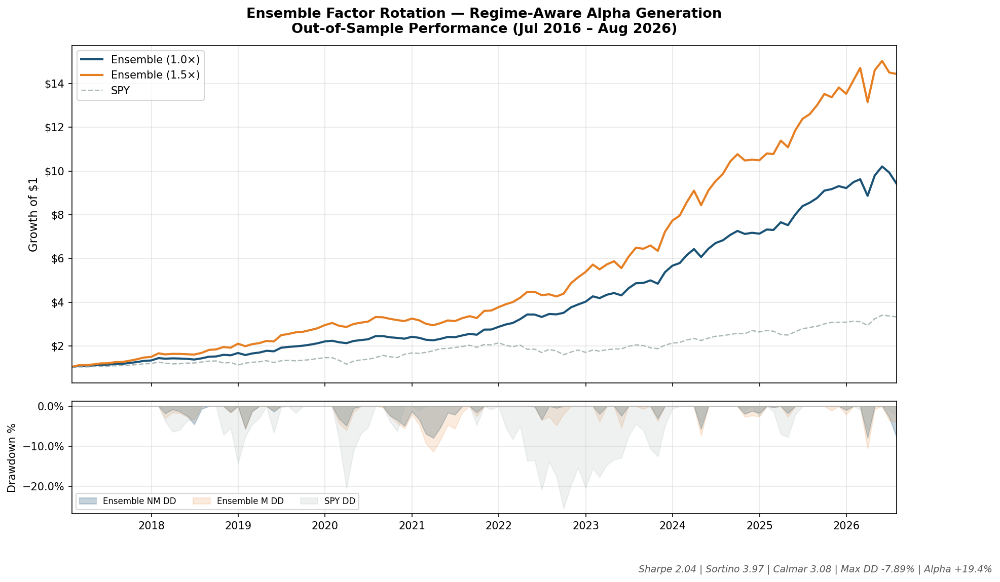
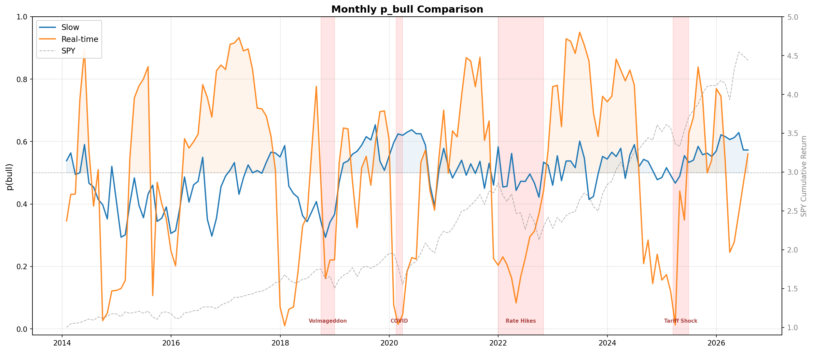

# Factor Rotation — Regime-Aware Systematic Portfolio

## Executive Summary

A systematic factor rotation strategy that combines two independent regime signals — one, that is slow-moving & lagged and the other more latent derived micro-structure signal that is contemporaneous — to dynamically allocate across 9 uncorrelated factor ETFs. The ensemble achieves **2.6× SPY's Sharpe ratio** with **less than one-third the drawdown** of SPY over a 10-year out-of-sample period. 

---

## Performance (Jul 2016 – Aug 2026)

| Metric           | Ensemble (1.0×) | SPY     |
| ---------------- | --------------- | ------- |
| **CAGR**         | +24.32%         | +14.01% |
| **Sharpe**       | 2.04            | 0.90    |
| **Sortino**      | 3.97            | 1.26    |
| **Calmar**       | 3.08            | 0.55    |
| **Max DD**       | -7.89%          | -25.48% |
| **Alpha (CAPM)** | +19.43%         | —       |
| **Beta vs SPY**  | 0.35            | 1.00    |
| **Rebalances**       | 42/115          |         |
| **Avg Turnover**     | 0.26            |         |

**Growth of $1 (with drawdown):**

---

## How It Works

### 1. Dual-Signal Regime Detection

Two independent signals identify market regime with no look-ahead bias:

- Slow — Lagged smoothed signal processed through a Gaussian Process + Dirichlet Process mixture. Detects macro regime shifts (expansionary vs contractionary).

- Real-Time — Latent variable derived from SPX prices detects stress before (in theory) it propagates to broader markets.

The two signals are **near-independent** (correlation 0.15), providing complementary coverage: One catches slow-moving liquidity cycles, while the other catches fast-moving stress events.

### 2. Factor Rotation via Bayesian Optimization

Monthly allocation across 9 uncorrelated factor ETFs:

| Factor             | Role             |
| ------------------ | ---------------- |
| Momentum           | Equity trend     |
| Min Volatility     | Defensive equity |
| Intermediate Bonds | Rate hedge       |
| Gold               | Inflation hedge  |
| Quality            | Quality tilt     |
| Commodities        | Real assets      |
| Managed Futures    | Trend following  |
| (2× SPY)           | Leveraged equity |
| (-1× SPY)          | Short equity     |

The Bayesian optimizer maximizes risk-adjusted returns while penalizing turnover. The regime signal modulates risk aversion in real-time — when stress is detected, the optimizer naturally reduces exposure to risky factors.

### 3. Downside Protection

During stress periods, the strategy's risk aversion parameter increases by 2.5×, causing the optimizer to shift toward defensive factors (low-vol, bonds, gold) without explicit override rules. ==This is thus more **structural protection**, than tactical timing.==

---

## Transaction Costs

| Component | Estimate |
|-----------|----------|
| Average monthly turnover | 33.66% |
| One-way cost (bid-ask + impact) | 5–10 bps |
| Annual cost drag | 0.20%–0.40% |
| Sharpe impact | 2.04 → 2.01 |

The strategy trades liquid, highly-quoted ETFs with tight spreads. Transaction costs reduce Sharpe by approximately 3bps..

The optimizer includes a built-in turnover penalty that limits unnecessary trading. Rebalancing occurs only when weight changes exceed 5%.

---

## Key Takeaways

- **Superior risk-adjusted returns**: Sharpe 2.04 vs SPY 0.90 (2.6× improvement)
- **Structural downside protection**: Max DD -7.89% vs SPY -25.48%
- **Regime-aware allocation**: Automatically reduces exposure during microstructure stress
- **Low cost drag**: Transaction costs reduce Sharpe by only 0.03
- **Fully systematic**: No discretionary decisions, no parameter overfitting

---

## Important Disclosures

- **Out-of-sample results**: All performance shown is out-of-sample (Jul 2016 – Aug 2026). In-sample training period used for model calibration only.
- **No guarantees**: Past performance does not guarantee future results. 
- **Model risk**: Regime detection models may produce false signals. Strategy relies on two independent signals to mitigate this risk.
- **Leverage risk**: The strategy uses leveraged ETFs (SSO) which carry additional risks including decay in choppy markets.

