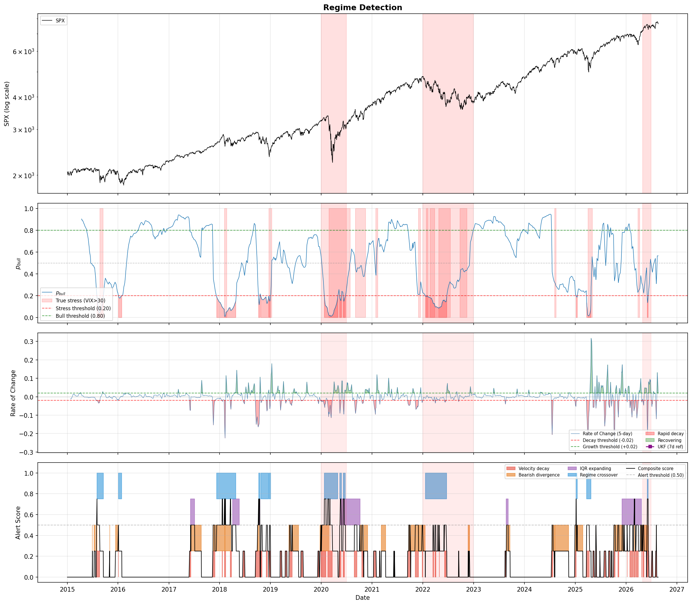

# Regime Detection — Daily Brief

**Report date:** 2026-08-21 08:51
**Data as of:** 2026-08-20 (last trading day)

## Chart

## Current Regime

**Status: NEUTRAL**

| Indicator | Latest | Status |
|-----------|--------|--------|
| p_bull | 0.567 | OK |
| Rate of Change (5d) | 0.0226 | GROWTH |
| Composite Alert | 0.00 | Low |
| SPX 60d return | +2.24% | — |
| Bearish Divergence | No | — |
| IQR Expanding | No | — |

---
